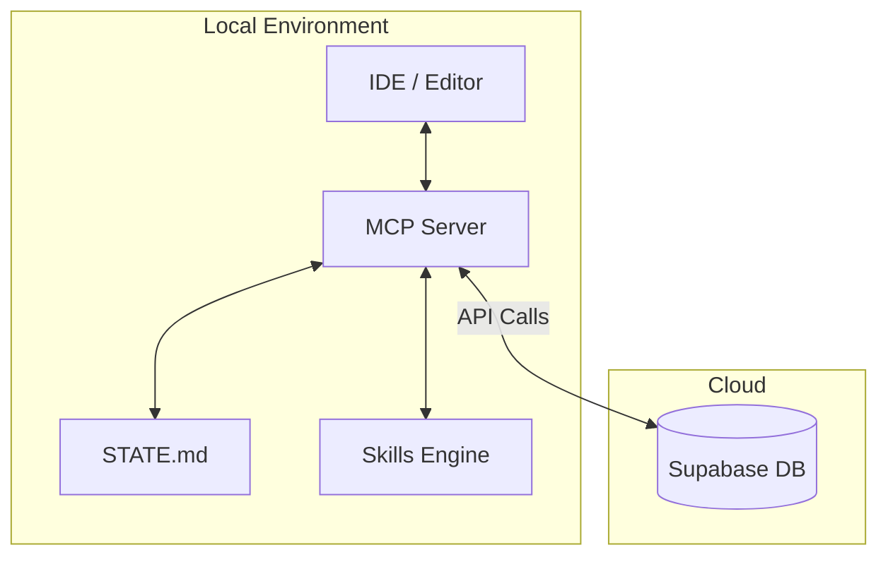
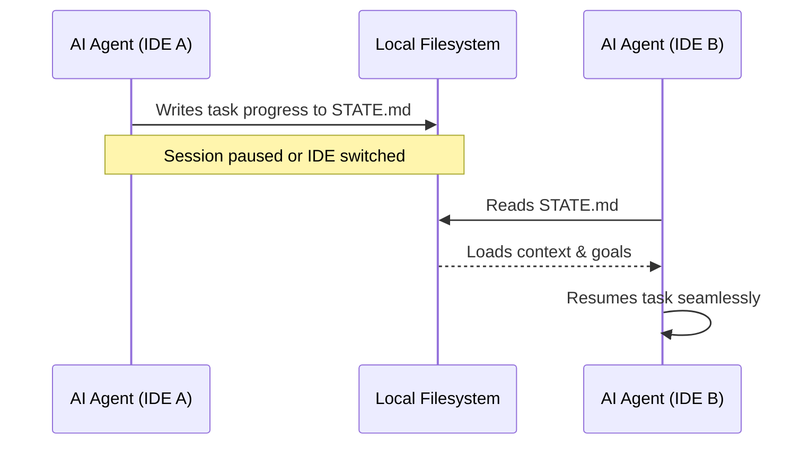

# Scout Architecture

This document provides a high-level overview of the Scout architecture. It explains how Scout orchestrates local AIs, detailing the boundaries between local execution and cloud storage, as well as our mechanisms for context persistence across different development environments.

## System Overview

Scout is built around three core pillars:
1. **The MCP Server**: Provides the local execution environment and tool integrations.
2. **The Cloud (Supabase)**: Handles persistence, user management, and shared state.
3. **The Skills Engine**: Enables composable, extensible AI behaviors.



## Cloud vs. Local Boundary

The boundary between the Cloud and the Local environment is clearly defined to ensure data privacy, low latency, and offline resilience when needed.

- **Local (MCP Server):** Handles immediate AI agent reasoning, code execution, local file system interactions, and the Skills Engine. It acts as the bridge to the developer's IDE.
- **Cloud (Supabase):** Stores persistent configurations, metadata, historical telemetry, and global knowledge graphs. The local server synchronizes with Supabase using minimal API calls to preserve performance.

### Supabase Schema

The Supabase database schema is designed to store essential metadata without holding sensitive local code context.

```sql
-- Example logical schema representation
CREATE TABLE users (
  id UUID PRIMARY KEY,
  settings JSONB
);

CREATE TABLE telemetry (
  id UUID PRIMARY KEY,
  event_type VARCHAR,
  timestamp TIMESTAMP
);
```

## The Skills Engine

The Skills Engine allows developers to write modular, reusable behaviors for the AI. A "Skill" is typically a set of prompts, tools, and execution steps that the MCP Server can load on demand.

- **Composability:** Skills can be chained together.
- **Extensibility:** New skills can be dropped into the system without recompiling the core MCP Server.

## Cross-IDE Resilience: `STATE.md` Handoff

One of Scout's unique features is the `STATE.md` manual handoff concept. This mechanism provides cross-IDE resilience and allows developers to switch between different AI models or environments without losing their place.

### How It Works

Instead of relying on proprietary, memory-based context stores locked to a single editor or process, Scout uses a plain text file (`STATE.md`) on the local filesystem as the ultimate source of truth for the current session's context.

1. **Serialization:** Before yielding control or pausing a task, the AI writes its current goals, completed steps, open questions, and context pointers to `STATE.md`.
2. **Deserialization:** When resuming work (even in a completely different IDE or terminal session), the new AI instance reads `STATE.md` to rebuild its context tree immediately.



This plain-text approach ensures transparency—developers can read and manually edit the state if they need to course-correct the AI.
