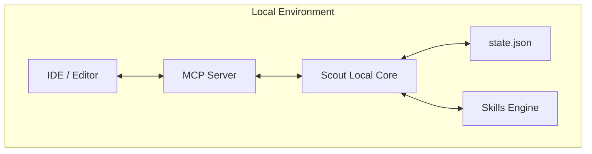
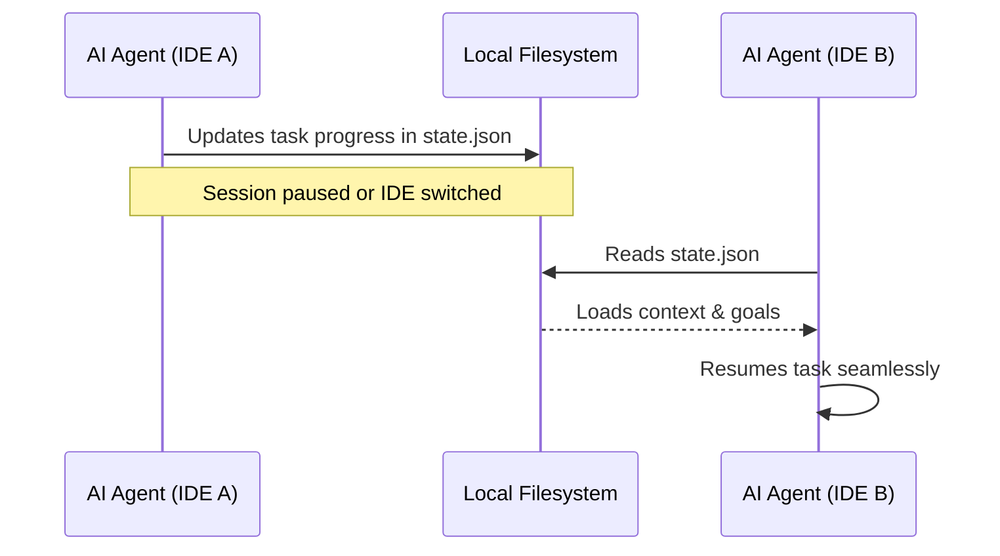

# Scout Architecture

> **Note:** Scout has evolved into two distinct architectural phases.
> - **Scout v1 (BYOB Cloud Web App):** The original dashboard-driven architecture relying on Supabase for the contribution pipeline. (See `docs/ARCHITECTURE.md` for details).
> - **Scout v2 (100% Offline Local MCP Execution Engine):** The current local-first, IDE-first execution engine focusing on safe, isolated AI execution. (See [SCOUT_V2_ARCHITECTURE.md](./SCOUT_V2_ARCHITECTURE.md) for the authoritative v2 reference).

This document provides a high-level overview of the Scout architecture. It explains how Scout orchestrates local AIs, detailing the local execution boundaries, and context persistence across different development environments.

## System Overview

Scout is built around two core pillars:
1. **The MCP Server & Local Core**: Provides the local execution environment, tool integrations, and execution lifecycle management.
2. **The Skills Engine**: Enables composable, extensible AI behaviors.

```mermaid
flowchart TD
    subgraph Local Environment
        IDE[IDE / Editor]
        MCP[MCP Server]
        Core[Scout Local Core]
        STATE[state.json]
        Skills[Skills Engine]
        
        IDE <--> MCP
        MCP <--> Core
        Core <--> STATE
        Core <--> Skills
    end
```

## The Skills Engine

The Skills Engine allows developers to write modular, reusable behaviors for the AI. A "Skill" is typically a set of prompts, tools, and execution steps that the MCP Server can load on demand.

- **Composability:** Skills can be chained together.
- **Extensibility:** New skills can be dropped into the system without recompiling the core MCP Server.

## Cross-IDE Resilience: Local State Handoff

One of Scout's unique features is the explicit local state handoff concept. This mechanism provides cross-IDE resilience and allows developers to switch between different AI models or environments without losing their place.

### How It Works

Instead of relying on proprietary, memory-based context stores locked to a single editor or process, Scout uses local state files (`.scout-tmp/state.json`) on the local filesystem as the ultimate source of truth for the current session's context.

1. **Serialization:** Before yielding control or pausing a task, the AI writes its current goals, completed steps, open questions, and context pointers into the execution state.
2. **Deserialization:** When resuming work (even in a completely different IDE or terminal session), the new AI instance reads the state to rebuild its context tree immediately.

```mermaid
sequenceDiagram
    participant Agent1 as AI Agent (IDE A)
    participant FS as Local Filesystem
    participant Agent2 as AI Agent (IDE B)
    
    Agent1->>FS: Updates task progress in state.json
    Note over Agent1,FS: Session paused or IDE switched
    Agent2->>FS: Reads state.json
    FS-->>Agent2: Loads context & goals
    Agent2->>Agent2: Resumes task seamlessly
```

This plain-text approach ensures transparency—developers can read and manually edit the state if they need to course-correct the AI.
