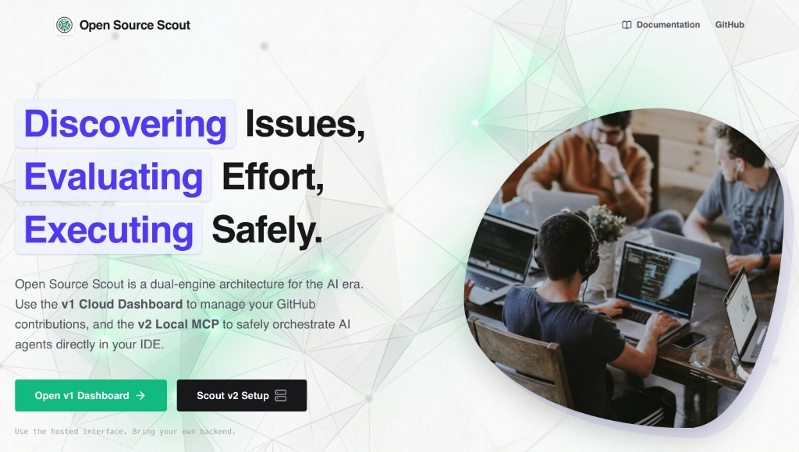

# Open Source Scout

> **Scout is a dual-engine architecture for the AI era.** Use the **v1 Cloud Dashboard** to manage your GitHub contributions, and the **v2 Local MCP** to safely orchestrate AI agents directly in your IDE.



## Try it Now — No Installation Required

The Scout v1 Cloud Dashboard is publicly hosted and ready to use:

🔗 **[https://rahul-pamula.github.io/Open_Source_Scout/](https://rahul-pamula.github.io/Open_Source_Scout/)**

Just bring your own Supabase backend and GitHub token. Setup takes about 5 minutes.

---

## The Dual-Engine Architecture

Scout is built for modern developers who use AI. It consists of two completely independent engines:

### ☁️ Part 1: The v1 Cloud Dashboard (For Humans)

A Bring-Your-Own-Backend (BYOB) platform that connects to your personal Supabase instance.

- **Issue Scanner:** Discovers open-source issues on GitHub that match your developer profile.
- **AI Evaluator:** Evaluates each issue with AI to tell you the difficulty and skill match.
- **Mission Control Pipeline:** Tracks your contributions through a visual Kanban pipeline (Discovered -> Claimed -> Assigned -> Review -> Merged).

### 🤖 Part 2: The v2 Local MCP Engine (For AI Agents)

A 100% offline local execution harness that your AI assistant (Cursor, Cline, Claude) connects to via the Model Context Protocol (MCP).

- **Git Worktree Isolation:** Isolates all AI code execution inside hidden `git worktrees` so your main branch is never corrupted.
- **CommandBoundaryGuard:** Enforces strict command boundaries so AI cannot escape your project directory (`cd ../..` is blocked).
- **Crash Recovery:** Recovers stale sessions by feeding the AI its own uncommitted diffs if the IDE crashes.

---

## 🚀 Getting Started

### Setting up the v1 Cloud Dashboard

Since Scout v1 is a BYOB architecture, you host the backend yourself on Supabase (free tier is perfect).

```bash
# Run the interactive setup CLI
npx open-source-scout setup
```

The CLI will automatically apply PostgreSQL migrations and deploy the Deno Edge Functions to your Supabase project. Then, just visit the [hosted dashboard](https://rahul-pamula.github.io/Open_Source_Scout/) and log in with your keys.

### Setting up the v2 Local MCP Engine

Add this JSON snippet to your AI assistant's MCP configuration file (Cursor, Cline, Claude Desktop):

```json
{
  "mcpServers": {
    "scout": {
      "command": "npx",
      "args": ["-y", "@scout/mcp"]
    }
  }
}
```

---

## 📚 Documentation

For a deep dive into the architecture, security guardrails, and deployment guides, check out the [Official Documentation](https://rahul-pamula.github.io/Open_Source_Scout/#/docs/01_getting_started/01_welcome).

---

## 🤝 Contributing

Contributions are welcome! Please read our [Contributing Guide](./CONTRIBUTING.md) and [Code of Conduct](./CODE_OF_CONDUCT.md).

## 📄 License

This project is licensed under the MIT License - see the [LICENSE](./LICENSE) file for details.
