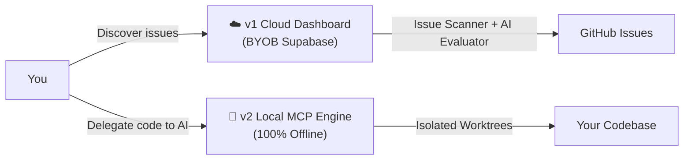

# Welcome to Open Source Scout

Welcome to Open Source Scout!

If you are a developer looking to contribute to open source, you probably know how painful it is to find an issue you can _actually_ work on — and how dangerous it is to let AI agents blindly execute code on your machine.

**Scout is designed to fix both problems.**

---

## Try it Now — No Installation Required

The Scout v1 Cloud Dashboard is publicly hosted and ready to use:

> 🔗 **[https://rahul-pamula.github.io/Open_Source_Scout/](https://rahul-pamula.github.io/Open_Source_Scout/)**

Just bring your own Supabase backend and GitHub token. Setup takes about 5 minutes.

---

## The Dual-Engine Architecture

Scout is a **dual-engine architecture** built for the AI era:

### ☁️ v1 Cloud Dashboard — For Humans

A Bring-Your-Own-Backend platform that connects to your personal Supabase instance. It:

- **Discovers** open-source issues on GitHub that match your developer profile.
- **Evaluates** each issue with AI to tell you the difficulty and skill match.
- **Tracks** your contributions through a visual Kanban pipeline.

### 🤖 v2 Local MCP Engine — For AI Agents

A 100% offline local execution harness that your AI assistant connects to via the Model Context Protocol. It:

- **Isolates** all AI code execution inside hidden `git worktrees`.
- **Enforces** strict command boundaries so AI cannot escape your project directory.
- **Recovers** stale sessions by feeding the AI its own uncommitted diffs.

> [!NOTE]
> The two engines are completely independent. You can use v1 without v2, or v2 without v1. They do not share any infrastructure.

---

## Which Engine Should I Start With?

| Goal                                                    | Start Here                                                                                           |
| ------------------------------------------------------- | ---------------------------------------------------------------------------------------------------- |
| I want to discover good open-source issues to work on   | [v1 Cloud Dashboard → Deploying BYOB](./03_v1_cloud_dashboard/01_deploying_byob)                     |
| I want my AI agent to safely execute code on my machine | [v2 Local MCP Engine → Universal Configuration](./02_v2_local_mcp_engine/02_universal_configuration) |
| I want both                                             | Start with v1 setup, then v2 configuration                                                           |
