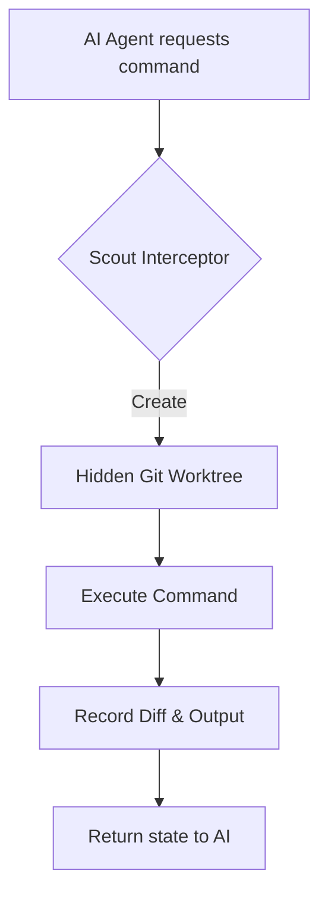

# Execution & Isolation

Scout v2's primary job is keeping your codebase safe. It does this through Git Worktree isolation.

## The Worktree Flow

1. **Submission:** When the AI agent wants to write code, it initiates a session.
2. **Isolation:** Scout creates a temporary git worktree inside `.scout-tmp/worktrees/`. This is a fully functional clone of your repository that shares the same git history but has a completely independent working directory.
3. **Execution:** All commands (`npm run build`, file edits, etc.) happen _inside_ this hidden worktree. Your main editor view remains completely clean.
4. **Review:** When the agent is finished, the session transitions to `SUBMITTED`, and a clean patch is generated for human review.
